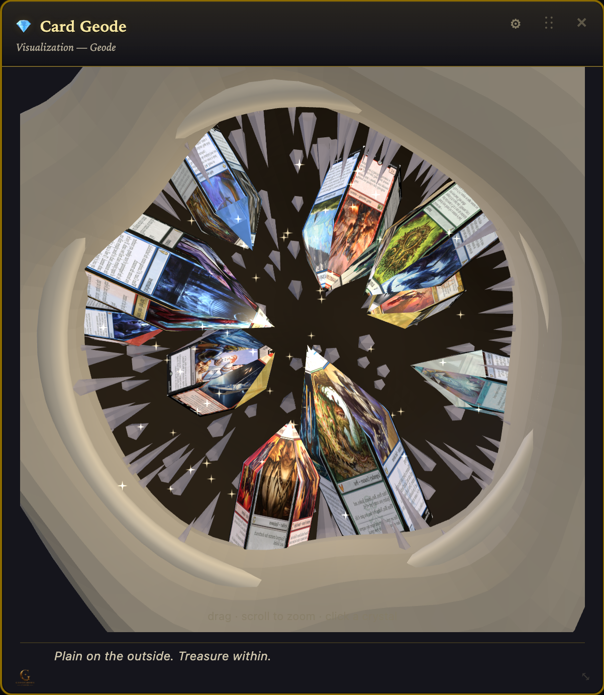
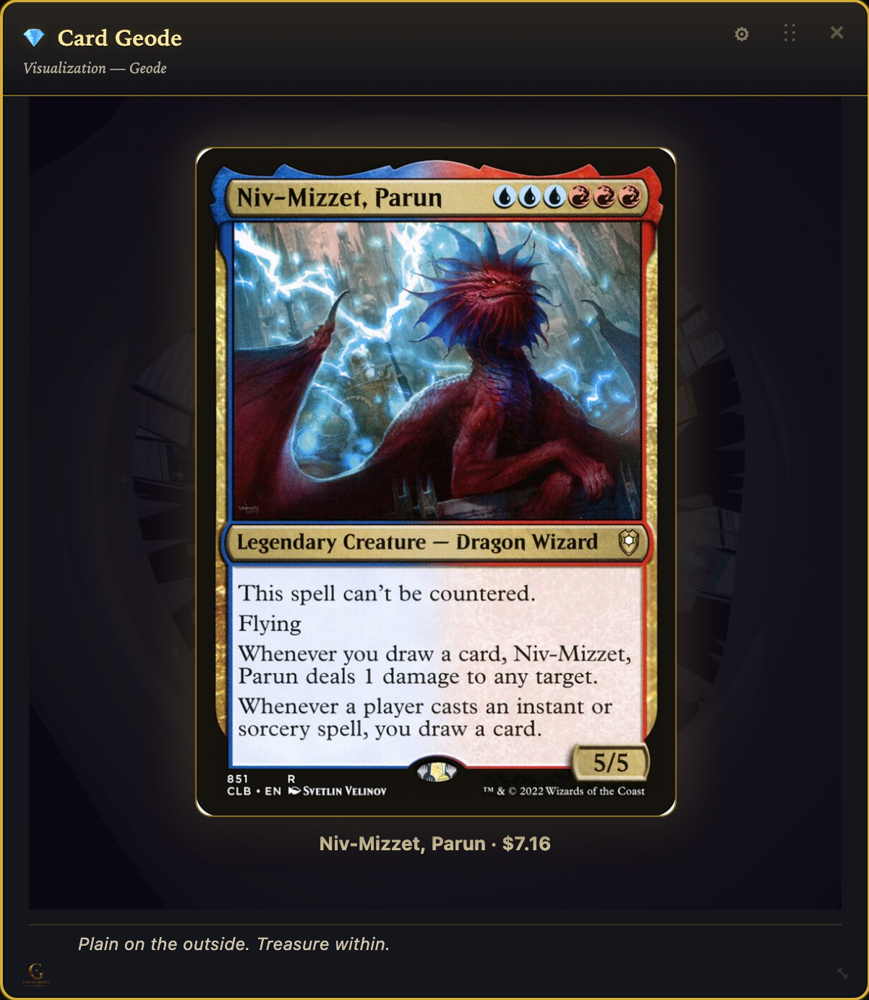
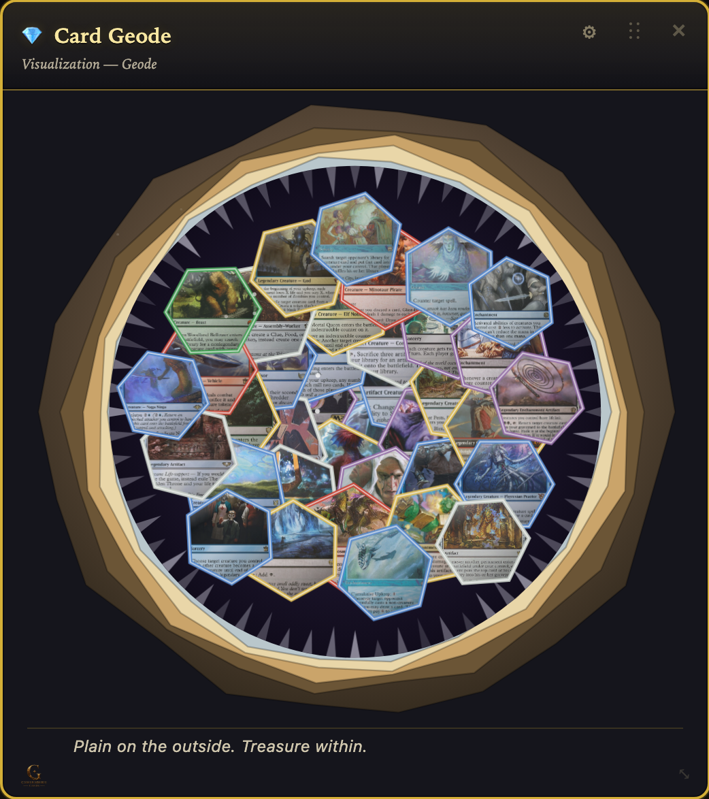
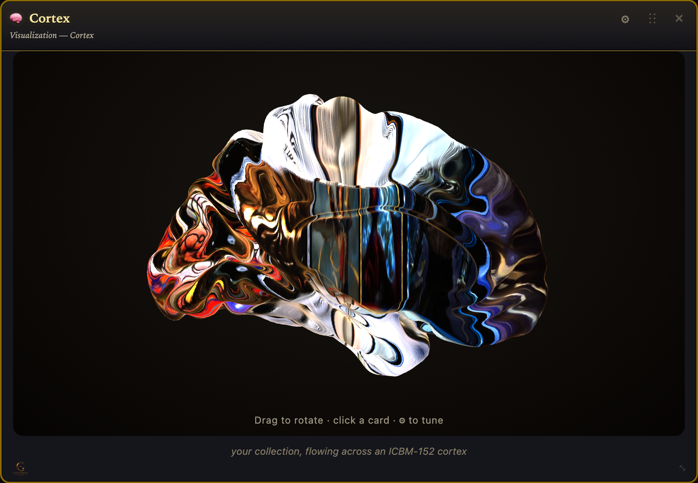
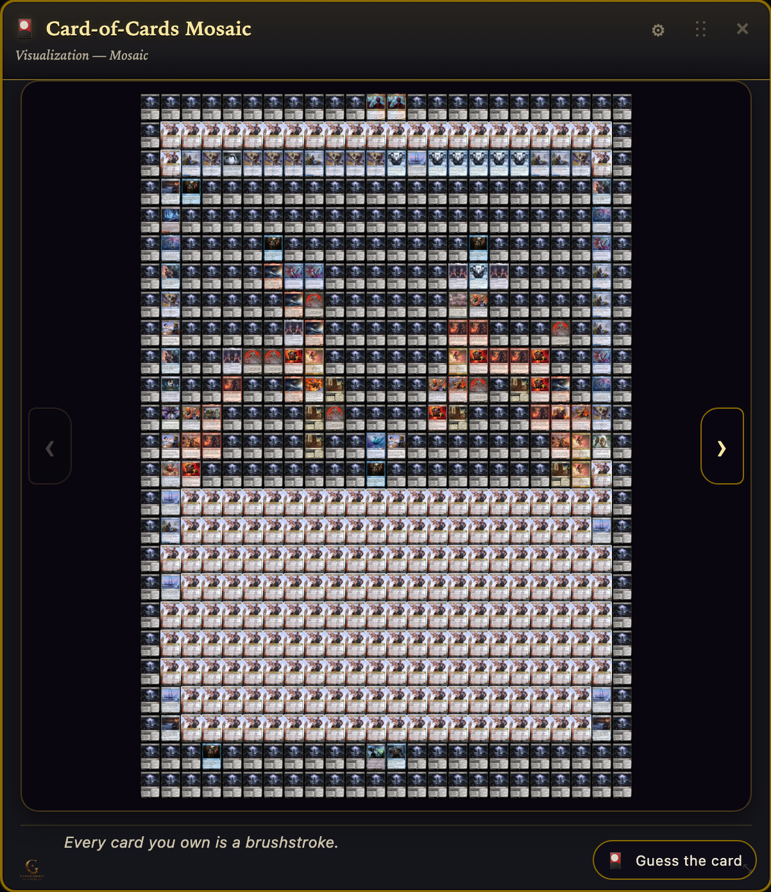

# Webcards 🃏✨

**Webcards** are the living dashboard cards inside
[cameraderiecards.com](https://cameraderiecards.com) — the stained-glass
mosaics, golden spirals, the brain "Cortex," and now the **Card Geode**: a
museum's worth of ways to *see* your collection.

Unlike the rest of this repo (which is proprietary), **this `webcards/`
directory is open source under the [MIT license](LICENSE)** so the community
can read, learn from, remix, and **improve** the cards — and propose new ones.
The first card published here is the **Card Geode**
([`cards/cc_card_geode.py`](cards/cc_card_geode.py)).

> Want to make the Geode shinier, fix a glitch, or invent a brand-new card?
> This is the place. PRs and ideas both welcome — see
> [Contributing](#contributing-a-webcard) below.

---

## The Card Geode

Your collection cracked open like a geode. In 3D, real quartz crystals grow
inward from the rock cavity wall with one of your cards mapped onto each
crystal face — drag to orbit, scroll to zoom, **click a crystal to view that
card**. There's also a flat 2D "agate slice."

| 3D crystal geode | Click a crystal → that card | 2D agate slice |
|:---:|:---:|:---:|
|  |  |  |

Source: [`cards/cc_card_geode.py`](cards/cc_card_geode.py). Gear settings (all
applied live): view · how many cards (top 10–250) · crystal tint · glow ·
sparkle · spin.

---

## More cards from the museum

The app has 30+ webcards. A couple more, to show the range of what's possible
(both have their source published here too, for reference):

| 🧠 Cortex | 🎴 Card-of-Cards Mosaic |
|:---:|:---:|
|  |  |
| Your cards' art drifts across a real anatomical brain (ICBM-152 cortex). [`cards/cc_cortex.py`](cards/cc_cortex.py) | A giant card silhouette woven from hundreds of tiny card-art tiles. [`cards/cc_card_of_cards.py`](cards/cc_card_of_cards.py) |

> **Note:** the **Card Geode** is the self-contained, easiest one to start
> from. Cortex and the Mosaic are published for reference/learning — they lean
> on app internals (the bulk Scryfall index, the image proxy, a bundled brain
> mesh) so they won't run standalone, but they're great pattern examples.

---

## What a webcard is

A webcard is a single Python module that returns a self-contained chunk of
HTML (with its own `<style>` and `<script>`). The app drops it into a slot on
the dashboard. That's the whole contract:

```python
CARD_GEODE_CATALOG_ENTRY = {
    "key": "card_geode",                 # unique id
    "label": "💎 Card Geode",            # shown in the "+ Add card" picker
    "desc": "…one-line description…",
    "type_line": "Visualization — Geode",
    "flavor": "Plain on the outside. Treasure within.",
    "default_w": 2, "default_h": 2, "min_w": 2, "min_h": 2,
}

def render_card_geode_card(ctx: dict) -> str:
    items = ctx["all_items"]             # the user's priced collection
    ...
    return f'<div class="card …">…<style>…</style><script>…</script></div>'
```

The app registers it by importing the entry + renderer. Your module is handed
a **`ctx`** dict; the field you'll use most is **`ctx["all_items"]`** — a list
of the user's priced cards. Each item has (the useful ones):

| field | meaning |
|---|---|
| `card_name` / `matched` / `card` | the card's name |
| `image_normal` / `image` / `image_small` | Scryfall image URL |
| `unit`, `qty` | price per copy, quantity owned |
| `color_identity` / `colors` | `["W","U",…]` |
| `matched_set` / `set` | set name |
| `category` | `"Singles"` / `"Sealed"` / `"Graded"` |
| `rarity`, `released_at`, `oracle_id` | extra metadata |

Per-card settings persist via the gear popover, which POSTs
`{section, key, value}` to `/set-pref` (stored under
`ctx["ui_prefs"]["panes"][section]`). **Apply settings client-side** — never
force a full page reload for a settings change.

### Patterns worth copying from the Geode

- **Self-contained**: all CSS + JS live in the returned string.
- **3D** uses Three.js from a CDN ES module; card art is routed through the
  app's same-origin image proxy (`/scryfall-img?url=…`) so WebGL textures
  aren't CORS-tainted.
- **Instant settings**: the gear updates the view in-place (no reload).
- **Lively but cheap**: animate with one `requestAnimationFrame` loop;
  prefer shared geometry/materials when you can.

---

## Contributing a webcard

Two ways in:

1. **💡 Idea** — open a
   [Feature request issue](../../issues/new?template=feature.yml) describing
   the card (what it shows, the interaction, a sketch). No code needed.
2. **🛠️ Code** — open a **Pull Request** that adds or improves a file in
   `webcards/cards/`. Keep it self-contained, match the module pattern above,
   and include a short note on what it does + a screenshot/GIF if you can.

The maintainer reviews submissions and chooses which to ship in the live app
(and may adapt them to fit the app's data + theme).

### Licensing of webcard contributions

Everything in `webcards/` is **MIT** (see [LICENSE](LICENSE)). By submitting a
webcard (or an improvement) here you agree that:

- your contribution is licensed under the MIT license above, **and**
- you grant Roger Newman-Norlund / Cameraderie Cards a **perpetual,
  worldwide, royalty-free license to use, modify, sublicense, and ship your
  contribution commercially** in Cameraderie Cards and related products.

You keep authorship/credit; you're giving permission for your card to become
part of the museum. (The "Cameraderie Cards" name, logo, and the rest of the
app stay proprietary — only the `webcards/` code is open.)

---

*Questions? Open a [Discussion](../../discussions) or ping
[@rnorlund](https://github.com/rnorlund).*
